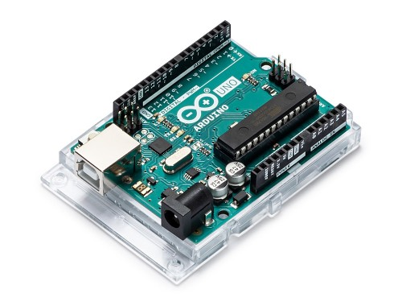
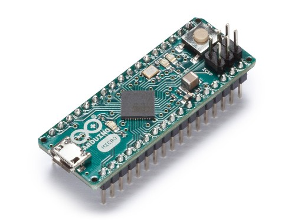
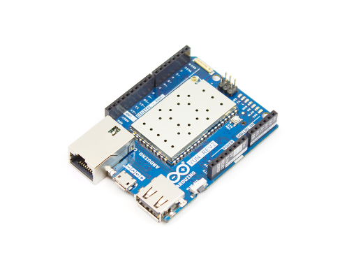
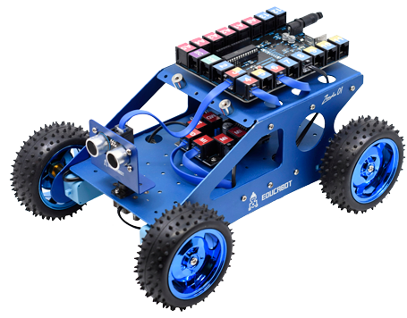
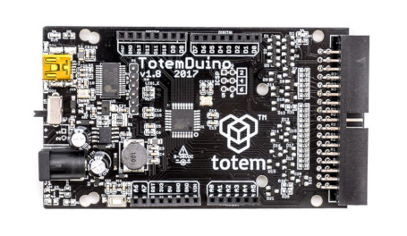

# Supported boards

Physical Bits was originally developed and tested using an Arduino UNO. So if your board is compatible with Arduino UNO chances are Physical Bits will work just fine.

If you try Physical Bits with a board not listed here please let us know about your experience.

## Arduino boards

We have tested the firmware using the following boards.

### [Arduino UNO](https://store.arduino.cc/usa/arduino-uno-rev3)

### [Arduino Nano](https://store.arduino.cc/usa/arduino-nano)

### [Arduino Micro](https://store.arduino.cc/usa/arduino-micro)

### [Arduino MEGA 2560](https://store.arduino.cc/usa/mega-2560-r3)

### [Arduino Yun](https://store.arduino.cc/usa/arduino-yun-rev-2)

## Other compatible boards

We have also received reports of the firmware working successfully on the following boards.

### [DuinoBot](https://www.robotgroup.com.ar/)

### [Educabot](https://educabot.com/)

### [TotemDUINO](https://totemmaker.net/product/totemduino-arduino/)

